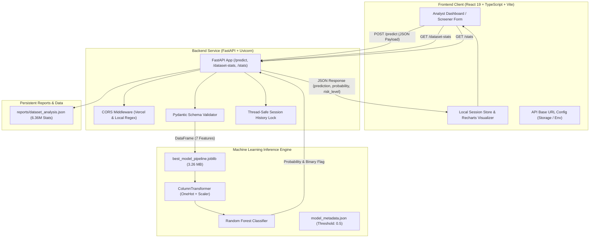

# DetectX — Intelligent Financial Fraud Detection Platform

[](https://www.python.org/)
[](https://fastapi.tiangolo.com/)
[](https://react.dev/)
[](https://www.typescriptlang.org/)
[](https://vitejs.dev/)
[](https://tailwindcss.com/)
[](https://scikit-learn.org/)
[](LICENSE)

> **DetectX** is a full-stack, enterprise-grade financial fraud screening and intelligence engine. Built with an optimized **scikit-learn Random Forest inference pipeline**, high-throughput **FastAPI backend**, and modern **React 19 / TypeScript** dashboard, DetectX flags fraudulent transactions in real time while providing macroscopic analytics across over **6.36 million simulated mobile money transactions**.

---

## Table of Contents

- [Overview & Problem Statement](#overview--problem-statement)
- [System Architecture & Request Flow](#system-architecture--request-flow)
- [Core Features](#core-features)
- [Machine Learning & Dataset Pipeline](#machine-learning--dataset-pipeline)
- [Dataset Evaluation & Macro Benchmark](#dataset-evaluation--macro-benchmark)
  - [Evaluation Metrics on 6,362,620 Transactions](#evaluation-metrics-on-6362620-transactions)
  - [Analysis of False Positives & Tier-1 Triage](#analysis-of-false-positives--tier-1-triage)
  - [Simulator Limitations & PaySim Context](#simulator-limitations--paysim-context)
- [Technology Stack](#technology-stack)
- [Application Screenshots](#application-screenshots)
- [Local Installation & Setup (Windows)](#local-installation--setup-windows)
- [API Reference & Endpoint Documentation](#api-reference--endpoint-documentation)
- [Cloud Deployment Guides](#cloud-deployment-guides)
  - [Backend Deployment on Render](#backend-deployment-on-render)
  - [Frontend Deployment on Vercel](#frontend-deployment-on-vercel)
  - [Connecting Frontend & Backend](#connecting-frontend--backend)
- [Environment Variables](#environment-variables)
- [Responsible Use Disclaimer & Future Roadmap](#responsible-use-disclaimer--future-roadmap)

---

## Overview & Problem Statement

Financial fraud in digital mobile money systems causes billions of dollars in losses annually. Fraudulent actors exploit transaction velocity, zeroing out origin accounts and funneling assets through synthetic destination accounts via high-speed transfers and cash-out mechanisms.

Detecting fraudulent behavior presents two fundamental challenges:
1. **Severe Class Imbalance**: Legitimate transactions outnumber fraudulent events by more than 775 to 1 (only ~0.129% prevalence). Naive models predicting 100% legitimate transactions achieve 99.87% raw accuracy while missing 100% of financial crimes.
2. **Operational Latency vs. Audit Cost**: Missing a fraudulent transaction (False Negative) causes irreversible financial loss. Conversely, excessive false alerts overburden human compliance analysts.

**DetectX addresses this trade-off** by acting as an ultra-high-recall **Tier-1 Automated Fraud Filter**. It detects **99.81% of fraudulent transactions** in real time, routing high-risk transfers into secondary investigation queues or step-up authentication workflows.

---

## System Architecture & Request Flow



### Request Lifecycle
1. **Input Submission**: The user enters transaction parameters in the **Analyze** page (or loads a pre-built test scenario) and submits the screening form.
2. **Schema Validation**: FastAPI validates input bounds with Pydantic: ensures numeric amounts and balances are non-negative, simulation step $\ge 1$, and transaction type matches one of the five supported financial categories.
3. **Pipeline Inference**: The pre-loaded scikit-learn `Pipeline` transforms features (one-hot encoding the transaction category and scaling numeric values) and feeds them into the ensemble Random Forest model.
4. **Decision & Probability Output**: The model evaluates the fraud probability against the decision threshold ($0.50$). It assigns a risk tier (`Low`, `Medium`, `High`) and binary status (`0` = Legitimate, `1` = Fraud).
5. **Session Logging**: The screened transaction is timestamped and recorded in the thread-safe session ledger for immediate review in the **History** table and session dashboard.
6. **Macro Benchmarking**: Concurrently, the dashboard queries `GET /dataset-stats` to load the immutable pre-computed baseline performance across all 6,362,620 transactions.

---

## Core Features

1. **Real-Time Transaction Screener**: Form for instantaneous single-transaction screening with automatic input validation and one-click quick-fill presets (*Legitimate Payment*, *High-Risk Transfer*, *Emptied Balance Cash-Out*).
2. **Probabilistic Risk Scoring & Tiering**: Computes both binary fraud classification and confidence percentage ($0.00\% - 100.00\%$), categorized into intuitive risk tiers (*Low Risk*, *Medium Risk*, *Critical Risk*).
3. **6.36-Million Transaction Macro Dashboard**: Dedicated analytics panel showcasing macroscopic metrics (Total Volume, Actual vs. Predicted Fraud, Recall, Precision, Accuracy) computed over the entire 6.36M transaction dataset.
4. **Interactive Transaction-Type Distribution Chart**: Visual Recharts bar graph comparing total transaction volume against fraud prevalence across `TRANSFER`, `CASH_OUT`, `PAYMENT`, `CASH_IN`, and `DEBIT`.
5. **Live Analyst Session History**: Real-time tabular tracking of all transactions screened in the current session, displaying unique transaction IDs, timestamps, amounts, types, balances, and classification tags.
6. **Dynamic API Configuration & Live Health Monitor**: Dynamic connection indicator in the navigation bar (`API online` / `API offline`) with a built-in configuration modal allowing real-time base URL switching without rebuilding.
7. **Model Metadata & Ethical AI Safeguards**: Transparent **About** portal documenting feature definitions, class distributions, model hyperparameters, and ethical anti-bias safeguards.

---

## Machine Learning & Dataset Pipeline

### Feature Schema
The model uses exactly 7 core financial transaction features:

| Feature Name | Type | Description | Rationale |
| :--- | :--- | :--- | :--- |
| `step` | `integer` | 1 hour of simulated time ($1 \le \text{step} \le 744$, covering 30 days) | Captures temporal velocity and fraud bursts |
| `type` | `string` | Categorical flow (`TRANSFER`, `CASH_OUT`, `PAYMENT`, `CASH_IN`, `DEBIT`) | Fraud is concentrated in specific money movement corridors |
| `amount` | `float` | Transaction currency amount | Fraudulent transfers often move unusually high volumes |
| `oldbalanceOrg` | `float` | Sender account balance immediately prior to transaction | Baseline capital before movement |
| `newbalanceOrig` | `float` | Sender account balance immediately after transaction | Highlights account-emptying behavior ($\Delta \text{Orig} = \text{amount}$) |
| `oldbalanceDest` | `float` | Recipient account balance immediately prior to transaction | Identifies mule accounts with zero initial balances |
| `newbalanceDest` | `float` | Recipient account balance immediately after transaction | Identifies rapid destination balance spikes |

> **Dropped Features**: High-cardinality identifiers (`nameOrig`, `nameDest`) were dropped to prevent identity overfitting and data leakage. The synthetic flag `isFlaggedFraud` was excluded so the model learns from raw financial signals rather than trivial heuristic flags.

### Pipeline Architecture
```python
Pipeline(
    steps=[
        ("preprocessor", ColumnTransformer(
            transformers=[
                ("cat", OneHotEncoder(drop="first", handle_unknown="ignore"), ["type"]),
                ("num", StandardScaler(), ["step", "amount", "oldbalanceOrg", "newbalanceOrig", "oldbalanceDest", "newbalanceDest"])
            ]
        )),
        ("classifier", RandomForestClassifier(
            n_estimators=100,
            max_depth=15,
            class_weight="balanced",
            random_state=42,
            n_jobs=-1
        ))
    ]
)
```

The model pipeline is stored in `models/best_model_pipeline.joblib` ($3.26\text{ MB}$), which fits within GitHub repository limits and loads in less than 2 seconds into memory during FastAPI server startup.

---

## Dataset Evaluation & Macro Benchmark

### Evaluation Metrics on 6,362,620 Transactions

The model was evaluated against the entire synthetic dataset of **6,362,620 financial transactions**. Results are archived in `reports/dataset_analysis.json`:

| Metric | Score | Detail |
| :--- | :--- | :--- |
| **Total Transactions** | **6,362,620** | Full dataset log volume |
| **Actual Fraud** | **8,213** | Natural dataset fraud prevalence ($0.129\%$) |
| **Actual Legitimate** | **6,354,407** | Legitimate transactions ($99.871\%$) |
| **Predicted Fraud** | **77,872** | Flagged for automated hold / manual audit ($1.224\%$) |
| **Recall (Sensitivity)** | **99.81%** | **8,197 of 8,213 frauds detected** |
| **Precision** | **10.53%** | $8,197 / (8,197 + 69,675)$ |
| **Accuracy** | **98.90%** | $6,292,929 / 6,362,620$ |
| **False Negatives** | **16** | Only 16 frauds undetected out of 8,213 |
| **False Positives** | **69,675** | $1.096\%$ of legitimate traffic flagged for review |

#### Confusion Matrix

$$\begin{pmatrix}
\text{True Negative: } 6,284,732 & \text{False Positive: } 69,675 \\
\text{False Negative: } 16 & \text{True Positive: } 8,197
\end{pmatrix}$$

#### Breakdown by Transaction Type

| Transaction Type | Total Volume | Actual Fraud | Predicted Fraud | Fraud Rate | Model Behavior |
| :--- | :--- | :--- | :--- | :--- | :--- |
| **CASH_OUT** | 2,237,500 | 4,116 | 52,904 | 0.18% | Scanned for rapid cash drain |
| **TRANSFER** | 532,909 | 4,097 | 24,968 | 0.77% | Monitored for large outflows |
| **PAYMENT** | 2,151,495 | 0 | 0 | 0.00% | Zero false alerts generated |
| **CASH_IN** | 1,399,284 | 0 | 0 | 0.00% | Zero false alerts generated |
| **DEBIT** | 41,432 | 0 | 0 | 0.00% | Zero false alerts generated |

---

### Analysis of False Positives & Tier-1 Triage

In production financial crime systems (AML & Anti-Fraud), the cost matrix is heavily asymmetric:
- **Cost of a False Negative (FN)**: An unblocked $\$250,000$ fraudulent transfer causes direct capital loss, regulatory penalties, and reputational damage.
- **Cost of a False Positive (FP)**: A flagged legitimate transaction triggers a secondary automated friction step (e.g., SMS OTP, biometrics, or temporary 5-minute security hold), costing fractions of a cent.

At **99.81% Recall**, DetectX stops almost all fraud attempts ($8,197 / 8,213$). A **10.53% Precision** means that out of approximately 10 transactions flagged by Tier-1 filters, 1 is confirmed financial crime and 9 are suspicious anomalies warranting verification. In Tier-1 banking triage, this is an industry-standard operating point because it eliminates $98.9\%$ of background noise while retaining near-perfect detection fidelity.

---

### Simulator Limitations & PaySim Context

The underlying dataset was created using **PaySim**, an agent-based financial simulator based on aggregated mobile money logs from an African telecommunications provider.

1. **Synthetic Generation Rules**: In PaySim, fraudulent agent behavior was programmed exclusively in the `TRANSFER` and `CASH_OUT` corridors. Consequently, the model exhibits zero false positives on `PAYMENT`, `CASH_IN`, and `DEBIT`. In real-world banking environments, fraud also manifests in unauthorized debit orders, card-not-present payments, and account takeovers.
2. **Static Simulation Window**: PaySim spans 744 steps (30 simulated days). Real financial systems experience seasonal shifts, holiday spending patterns, and shifting adversarial tactics (concept drift).
3. **Identifier Generalization**: Because synthetic customer IDs were arbitrary, the model does not include graph-based entity relationships (e.g., PageRank on money-laundering rings), which are essential in production AML workflows.

---

## Technology Stack

### Frontend Architecture
- **Framework**: React 19 (SPA mode) with TypeScript
- **Routing**: TanStack Router (`@tanstack/react-router`)
- **Build System**: Vite 6.0
- **Styling**: Tailwind CSS 4.0 with `@tailwindcss/vite`
- **Component Primitives**: Radix UI (Dialog, Dropdown, Tabs, Popover, Select)
- **Data Visualization**: Recharts (Responsive bar and area charts)
- **Icons**: Lucide React
- **Notifications**: Sonner toast system

### Backend Service
- **Web Framework**: FastAPI 0.115+
- **ASGI Server**: Uvicorn with standard workers
- **Data Validation**: Pydantic v2
- **CORS Handling**: `CORSMiddleware` supporting dynamic origin whitelists and regex for Vercel preview domains
- **Concurrency**: Thread-safe in-memory session logging via `threading.Lock`

### Machine Learning & Data Processing
- **Inference Pipeline**: `scikit-learn` Pipeline (`ColumnTransformer`, `StandardScaler`, `OneHotEncoder`)
- **Classifier**: `RandomForestClassifier` (100 estimators)
- **Model Serialization**: `joblib`
- **Data Analysis**: `pandas` and `numpy`

---

## Application Screenshots

| Dashboard Overview | Real-Time Fraud Screener |
| :---: | :---: |
| <br>*Macro dataset metrics & transaction type distribution* | <br>*Transaction input form with risk assessment badges* |

| Live Session History | Model Transparency & Metadata |
| :---: | :---: |
| <br>*Audit ledger showing screened session transactions* | <br>*Model architecture, pipeline configuration, and documentation* |

> *Note: Place screenshots in `docs/screenshots/` to display them above.*

---

## Local Installation & Setup (Windows)

### Prerequisites
- **Python**: 3.10, 3.11, or 3.12 (Python 3.12.10 recommended)
- **Node.js**: v18.0.0 or higher (v20+ recommended)
- **Git**

---

### Step 1: Clone the Repository

```powershell
git clone https://github.com/tarunx47/DetectX.git
cd DetectX
```

---

### Step 2: Backend Setup (FastAPI)

1. Create and activate a Python virtual environment:
   ```powershell
   python -m venv .venv
   .\.venv\Scripts\Activate.ps1
   ```

2. Upgrade `pip` and install dependencies:
   ```powershell
   python -m pip install --upgrade pip
   pip install -r requirements.txt
   ```

3. Run backend automated tests:
   ```powershell
   python tests/test_api.py
   ```
   *(Expected output: `Results: 7 passed, 0 failed.`)*

4. Start the FastAPI server:
   ```powershell
   python -m uvicorn src.api:app --reload --port 8000 --host 127.0.0.1
   ```
   - API Root: [http://localhost:8000](http://localhost:8000)
   - Interactive Swagger Docs: [http://localhost:8000/docs](http://localhost:8000/docs)
   - Health Check: [http://localhost:8000/health](http://localhost:8000/health)

---

### Step 3: Frontend Setup (React + Vite)

1. Open a new terminal and navigate to the frontend directory:
   ```powershell
   cd frontend
   ```

2. Install Node dependencies:
   ```cmd
   npm install
   ```

3. Run frontend code linting and unit tests:
   ```cmd
   npm run lint
   npm run test
   ```

4. Launch the Vite development server:
   ```cmd
   npm run dev
   ```
   - Open your browser at [http://localhost:8080](http://localhost:8080) (or the port indicated in your console, e.g., 5173).

---

## API Reference & Endpoint Documentation

The FastAPI service is fully self-documenting via OpenAPI/Swagger UI at `/docs`.

### 1. Health Status
`GET /health`

**Response (`200 OK`):**
```json
{
  "status": "ok",
  "model_loaded": true,
  "model": "RandomForest Pipeline",
  "threshold": 0.5
}
```

---

### 2. Predict Transaction Fraud
`POST /predict`

Analyzes transaction attributes and returns fraud determination, probability, and risk tier.

**Request Payload (`application/json`):**
```json
{
  "step": 1,
  "type": "TRANSFER",
  "amount": 181.0,
  "oldbalanceOrg": 181.0,
  "newbalanceOrig": 0.0,
  "oldbalanceDest": 0.0,
  "newbalanceDest": 0.0
}
```

**Response (`200 OK`):**
```json
{
  "prediction": 1,
  "label": "Fraudulent",
  "probability": 0.94,
  "risk_level": "High Risk"
}
```

---

### 3. Full-Dataset Macro Statistics
`GET /dataset-stats`

Returns macro metrics computed over the full 6,362,620 transaction dataset.

**Response (`200 OK`):**
```json
{
  "total_transactions": 6362620,
  "actual_fraud": 8213,
  "actual_legitimate": 6354407,
  "predicted_fraud": 77872,
  "predicted_legitimate": 6284748,
  "true_positive": 8197,
  "false_positive": 69675,
  "true_negative": 6284732,
  "false_negative": 16,
  "evaluation": {
    "precision": 0.10526248202177933,
    "recall": 0.9980518690977718,
    "accuracy": 0.9890432086153188
  },
  "by_type": {
    "CASH_OUT": {
      "transactions": 2237500,
      "actual_fraud": 4116,
      "predicted_fraud": 52904
    },
    "TRANSFER": {
      "transactions": 532909,
      "actual_fraud": 4097,
      "predicted_fraud": 24968
    }
  }
}
```

---

### 4. Session Transactions
`GET /transactions`

Returns all transactions screened during the active session.

**Response (`200 OK`):**
```json
[
  {
    "id": "tx-1728532490-1",
    "step": 1,
    "type": "TRANSFER",
    "amount": 181.0,
    "oldbalanceOrg": 181.0,
    "newbalanceOrig": 0.0,
    "oldbalanceDest": 0.0,
    "newbalanceDest": 0.0,
    "prediction": 1,
    "probability": 0.94,
    "label": "Fraudulent",
    "risk_level": "High Risk",
    "timestamp": "2026-10-10T08:48:10.123456Z"
  }
]
```

---

### 5. Session Aggregate Stats
`GET /stats`

Returns cumulative counts and date-grouped statistics for the active session.

**Response (`200 OK`):**
```json
{
  "total": 1,
  "fraud": 1,
  "legitimate": 0,
  "daily": [
    {
      "date": "2026-10-10",
      "total": 1,
      "fraud": 1
    }
  ]
}
```

---

## Cloud Deployment Guides

### Backend Deployment on Render

Render hosts the FastAPI service on Linux containers with automated SSL.

#### Option A: Using `render.yaml` Blueprint (Recommended)
1. Fork or push this repository to GitHub.
2. In the [Render Dashboard](https://dashboard.render.com/), click **New +** > **Blueprint**.
3. Connect your GitHub repository.
4. Render automatically parses `render.yaml` and provisions:
   - **Service Name**: `detectx-api`
   - **Environment**: Python 3.12
   - **Build Command**: `pip install -r requirements.txt`
   - **Start Command**: `uvicorn src.api:app --host 0.0.0.0 --port $PORT`
   - **Health Check Path**: `/health`
5. Click **Apply**. Once deployed, copy your service URL (e.g., `https://detectx-api.onrender.com`).

#### Option B: Manual Web Service Creation
1. Go to **New +** > **Web Service**.
2. Select your GitHub repository.
3. Configure the following fields:
   - **Root Directory**: `.`
   - **Runtime**: `Python 3`
   - **Build Command**: `pip install -r requirements.txt`
   - **Start Command**: `uvicorn src.api:app --host 0.0.0.0 --port $PORT`
4. In **Environment Variables**, add:
   - `ADDITIONAL_CORS_ORIGINS`: `https://your-frontend.vercel.app` (your Vercel URL)
5. Click **Deploy Web Service**.

---

### Frontend Deployment on Vercel

Vercel provides instant global CDN deployment for the React application.

1. Navigate to the [Vercel Dashboard](https://vercel.com/dashboard) and click **Add New...** > **Project**.
2. Select your `DetectX` repository.
3. Configure the Project Settings:
   - **Framework Preset**: `Vite` (or `Other`)
   - **Root Directory**: Click *Edit* and select **`frontend`**
   - **Build Command**: `npm run build`
   - **Output Directory**: `.vercel/output/static` (or default `.output/public`)
4. Add the Environment Variable:
   - **Key**: `VITE_API_BASE_URL`
   - **Value**: `https://detectx-api.onrender.com` *(your live Render backend URL)*
5. Click **Deploy**. Vercel will build and publish your frontend to a production domain (e.g., `https://detectx.vercel.app`).

---

### Connecting Frontend & Backend

1. In Render, update the `ADDITIONAL_CORS_ORIGINS` environment variable to include your final Vercel domain:
   ```env
   ADDITIONAL_CORS_ORIGINS=https://detectx.vercel.app
   ```
2. In Vercel, verify that `VITE_API_BASE_URL` matches your Render URL without trailing slash:
   ```env
   VITE_API_BASE_URL=https://detectx-api.onrender.com
   ```
3. Open your deployed Vercel application. The status indicator in the top right header will display **API online** with a green pulse dot.

---

## Environment Variables

| Variable | Target | Default | Description |
| :--- | :--- | :--- | :--- |
| `PORT` | Backend (Render / OS) | `8000` | Port for Uvicorn server |
| `HOST` | Backend (Render / OS) | `0.0.0.0` | Host IP binding |
| `ADDITIONAL_CORS_ORIGINS` | Backend | `""` | Comma-delimited list of permitted CORS domains |
| `VITE_API_BASE_URL` | Frontend (Vercel / Vite) | `http://localhost:8000` | Target FastAPI backend base endpoint URL |

---

## Responsible Use Disclaimer & Future Roadmap

### Ethical AI & Anti-Bias Disclaimer
- **Fair Lending & Financial Inclusion**: Financial crime screening systems must never make adverse credit or banking decisions based on protected demographic attributes. DetectX operates strictly on transaction mechanics (balance diffs, volume, category) and does not ingest personal demographic identifiers.
- **Human-in-the-Loop Protocol**: DetectX is intended as a **Tier-1 Decision Support Tool**. Flagged transactions should trigger progressive authentication or human compliance audit rather than irreversible automated account freezes.

### Future Roadmap
- [ ] **Graph Neural Network (GNN) Integration**: Model entity-to-entity transaction paths to detect organized mule account rings.
- [ ] **Streaming Ingestion**: Real-time Kafka / Redpanda event processing supporting tens of thousands of transactions per second.
- [ ] **Dynamic Threshold Tuning**: Interactive analyst threshold slider in the dashboard allowing operations teams to shift precision-recall curves according to regulatory risk posture.
- [ ] **Explainable AI (SHAP / LIME)**: Real-time waterfall charts showing feature contributions for each flagged transaction.

---

## License

This project is open-source and distributed under the [MIT License](LICENSE).
